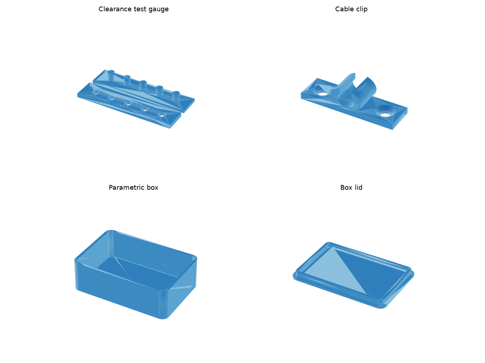

# AI-Driven 3D Prototyping Starter Kit

A code-first workflow for prototyping on a Bambu Lab printer, designed so AI
does the modeling work and you do the deciding. Parts are defined as short
Python scripts ([build123d](https://build123d.readthedocs.io/)) instead of
being drawn by hand in a CAD GUI — which means an AI assistant can write,
read, and modify every part for you, and every design is versioned in git.



## The loop

```
describe the part in plain words
        │
        ▼
AI writes/edits a parametric Python script   ←──┐
        │                                       │
        ▼                                       │
run the script → STL file                       │  adjust one number,
        │                                       │  re-run
        ▼                                       │
slice in Bambu Studio → print                   │
        │                                       │
        ▼                                       │
measure / test the fit ─────────────────────────┘
```

The mesh (STL) is a build artifact. The *source of truth* is the script —
that's what you tweak, share, and keep.

## Quick start

```bash
pip install build123d
cd 3d-prototyping
python parts/clearance_test.py     # writes stl/clearance_test.stl
```

Open the STL in **Bambu Studio** (or drag it in), slice with the default
0.20 mm profile, print in PLA.

## Print this first: the clearance test

FDM printers don't print holes and pegs at exact size — every machine +
filament combo has its own tolerance. `clearance_test.stl` is a gauge:
five 5.00 mm pegs and five holes oversized by 0.0–0.4 mm (values engraved
on the plate). Print it, press the peg bar into the plate, and record:

| Fit | Meaning | Typical Bambu + PLA |
|---|---|---|
| Press fit | peg goes in with force, stays | ~0.1 mm |
| Snug fit | slides in, no wobble | ~0.2 mm |
| Free fit | slides freely (lids, hinges) | ~0.3 mm |

Those three numbers are *your* numbers. Every parametric part here has a
`CLEARANCE` parameter — plug yours in and fits come out right the first time.

## The parts

| Script | What it teaches |
|---|---|
| `parts/clearance_test.py` | your printer's real tolerances |
| `parts/cable_clip.py` | measure a real object → parametric fit (change `CABLE_DIAMETER`, re-run) |
| `parts/parametric_box.py` | two mating parts, friction fit, wall/perimeter thinking |

Each script has its parameters at the top and exports to `stl/` when run.

## How to ask AI for new parts

Open this repo in Claude Code (or paste a script into any Claude chat) and
describe the part with real measurements. A prompt template that works well:

> Using build123d like the parts in `3d-prototyping/parts/`, design a
> **[wall hook / phone stand / drawer divider]**. Constraints:
> **[holds 2 kg, fits a 18 mm rail, 45° angle]**. It must print on FDM
> without supports, walls at least 1.6 mm, and use `CLEARANCE = 0.2` for
> any sliding fit. Put all dimensions as named parameters at the top and
> export an STL.

Then iterate the same way you'd review code: "make the base 10 mm wider",
"add a fillet so it doesn't crack", "the hole was tight, add 0.1 mm".

## Bambu-specific tips

- **Start with PLA** on the textured PEI plate — near-zero tuning needed.
- **Default 0.20 mm "Standard" profile** is fine for prototypes; switch to
  0.28 mm Draft when iterating fast (parts print ~30% quicker).
- **Design away supports** instead of adding them: flat base on the bed,
  chamfers instead of overhangs, holes printed vertically.
- **Orientation = strength**: layers are the weak direction. Print parts so
  bending loads run *along* layers, not across them.
- **MakerWorld** (Bambu's model site) is worth checking before designing
  something generic — but for anything that must *fit* your exact object,
  parametric code beats downloading and hoping.
- Check the **first layer** for the first minute; 90% of failures show up
  there.

## Where to go next

- **Live 3D preview while coding**: `pip install ocp-vscode` + the
  "OCP CAD Viewer" VS Code extension — see the model update on every run.
- **Organic / artistic shapes**: generative tools (Meshy, Tripo, Hunyuan3D)
  produce meshes from a text prompt or photo; clean up in Blender.
- **Scanning real objects**: photogrammetry apps (Polycam and similar) turn
  a phone video into a mesh you can design around.
- **build123d docs**: <https://build123d.readthedocs.io/> — the examples
  gallery is excellent prompt fodder.
